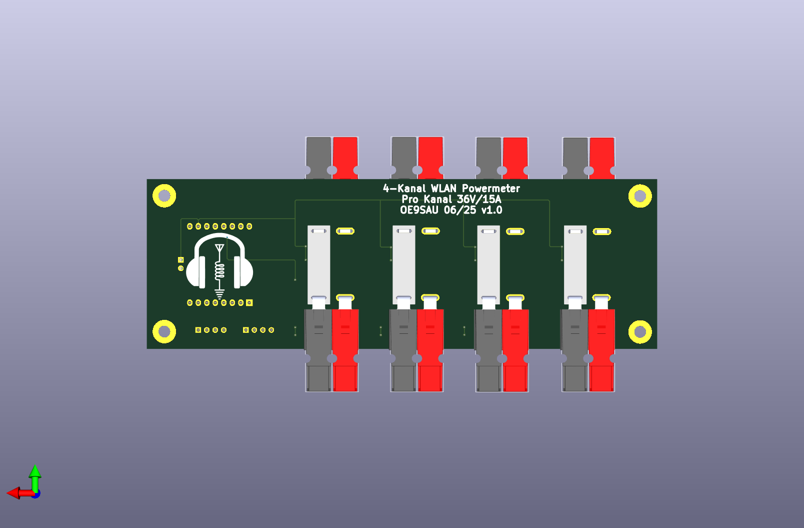

**4-Channel WiFi Power Meter Using Wemos D1 and INA226 (or Compatible INAxxx Sensors)**

This project utilizes the Wemos D1 (ESP8266) microcontroller paired with INA226 current/voltage sensors (or any compatible INAxxx series) to provide precise, real-time measurements of electrical parameters across four independent channels.

Technical Specifications:
* Voltage Measurement Range: up to 36 V DC per channel
* Current Measurement Range: up to 13-15A per channel (when PCB traces are properly soldered (~0,3 mm) around 20A
* Sensor: INA226 (bidirectional current and voltage sensor with high accuracy)
* Microcontroller: Wemos D1 (ESP8266) for WiFi connectivity and data transmission
* Communication: Wireless data streaming via WiFi for remote monitoring
* Applications: Multi-channel power consumption monitoring, load analysis, and energy management

| Parameter              | Wert                                              |
| ---------------------- | ------------------------------------------------- |
| Shunt-Widerstand       | 2 mΩ                                              |
| Maximalstrom           | 20 A                                              |
| Shuntspannung @ 20 A   | 40 mV                                             |
| Verlustleistung @ 20 A | 0.8 W                                             |
| Current\_LSB           | 625 µA                                            |
| Calibration-Wert       | **4096**                                          |
| Stromauflösung         | 0.625 mA / Bit                                    |
| Leistungsauflösung     | $25 \cdot \text{LSB} = \boxed{15.625\,\text{mW}}$ |
